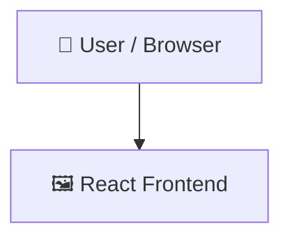

# Notesy

> A React and Vite web application for linking and organizing notes.

## 📑 Table of Contents

- [Description](#description)
- [Key Features](#key-features)
- [Use Cases](#use-cases)
- [Tech Stack](#tech-stack)
- [Architecture](#architecture)
- [Quick Start](#quick-start)
- [Key Dependencies](#key-dependencies)
- [Available Scripts](#available-scripts)
- [Project Structure](#project-structure)
- [Development Setup](#development-setup)
- [Deployment](#deployment)
- [Contributors](#contributors)
- [Contributing](#contributing)

## 📝 Description

Notesy is a front-end note-linking web application built to help users manage, connect, and view related notes. Created with React and Vite, it provides an interactive canvas-style interface for organizing ideas without unnecessary backend overhead.

## ✨ Key Features

- **🧭 Client-Side Routing via React Router** — Uses React Router DOM to manage routes including the homepage and foreground views.
- **✨ Animated Elements with Framer Motion** — Incorporates Framer Motion to power fluid UI transitions and interactive visual components.
- **🎨 Utility-First Tailwind CSS Styling** — Employs Tailwind CSS for responsive layout structuring and modular styling.
- **⚡ Vite-Powered Development and Bundling** — Leverages Vite for fast local hot module replacement and optimized production builds.

## 🎯 Use Cases

- Organizing and connecting personal ideas through a visual, interactive notes interface.
- Using as a lightweight frontend template for building canvas-based React applications with Framer Motion.

## 🛠️ Tech Stack

   

**Notable libraries:** Framer Motion

## 🏗️ Architecture

A high-level view of how the main pieces fit together:



## ⚡ Quick Start

```bash

# 1. Clone the repository
git clone https://github.com/Alone-Prodipta/Notesy.git

# 2. Install dependencies
npm install

# 3. Start the dev server
npm run dev
```

## 📦 Key Dependencies

```
@tailwindcss/vite: ^4.3.3
@xyflow/react: ^12.11.6
bootstrap: ^5.3.8
framer-motion: ^13.2.0
react: ^19.2.8
react-bootstrap: ^2.10.10
react-dom: ^19.2.8
react-icons: ^5.7.0
react-router-dom: ^7.18.3
tailwindcss: ^4.3.3
```

## 🚀 Available Scripts

- **dev** — `npm run dev`
- **build** — `npm run build`
- **lint** — `npm run lint`
- **preview** — `npm run preview`

## 📁 Project Structure

```
.
├── eslint.config.js
├── index.html
├── netlify.toml
├── package.json
├── public
│   └── _redirects.txt
├── src
│   ├── App.css
│   ├── App.jsx
│   ├── components
│   │   ├── Foreground
│   │   │   └── foreground.jsx
│   │   ├── card.jsx
│   │   ├── header.jsx
│   │   └── homepage.jsx
│   ├── index.css
│   ├── index.jsx
│   └── main.jsx
└── vite.config.js
```

## 🛠️ Development Setup

### Node.js / JavaScript
1. Install Node.js (v18+ recommended)
2. Install dependencies: `npm install` (or `yarn` / `pnpm install` / `bun install`)
3. Start the dev server: see the **Quick Start** above

## 🚢 Deployment

### Netlify

This project is configured for [Netlify](https://netlify.com). Connect the repo or run `netlify deploy`.

## 👥 Contributors

Thanks to everyone who has contributed to this project:

<p align="left">
<a href="https://github.com/Alone-Prodipta" title="Alone-Prodipta"></a>
</p>

[See the full list of contributors →](https://github.com/Alone-Prodipta/Notesy/graphs/contributors)

## 👥 Contributing

Contributions are welcome! Here's the standard flow:

1. **Fork** the repository
2. **Clone** your fork: `git clone https://github.com/Alone-Prodipta/Notesy.git`
3. **Branch**: `git checkout -b feature/your-feature`
4. **Commit**: `git commit -m 'feat: add some feature'`
5. **Push**: `git push origin feature/your-feature`
6. **Open** a pull request

Please follow the existing code style and include tests for new behavior where applicable.

---

<div align="center">

[](https://readmebuddy.com)

<sub>Generate beautiful READMEs in seconds → <a href="https://readmebuddy.com">readmebuddy.com</a></sub>

</div>
